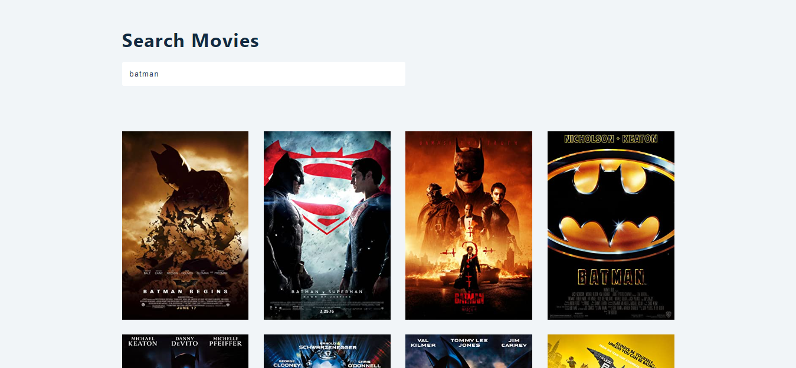

# Movie DB

Course exclusive project from [React Projects](https://react-projects.netlify.app/) by [John Smilga](https://github.com/john-smilga).

## Link

- [Project URL](https://movie-db-website-react.netlify.app/) (hosted on Netlify)

## Screenshot

## Project

Users should be able to:

- Type a movie title they want to search for in the input field
- See a list of poster of movies with similar titles
- Click on a movie poster to see more information about the movie

## Built with

- Semantic HTML5 markup
- CSS custom properties (provided by the course instructor)
- JavaScript
- React
- React Router
- [OMDb API](https://www.omdbapi.com/)

## Author

Chiara Stefanelli - Front-End Development Student based in Italy

- Website - [Chiara Stefanelli](https://chiarastefanelli.netlify.app/)
- LinkedIn - [Chiara Stefanelli](https://www.linkedin.com/in/chiarastefanelli/?locale=en_US)
